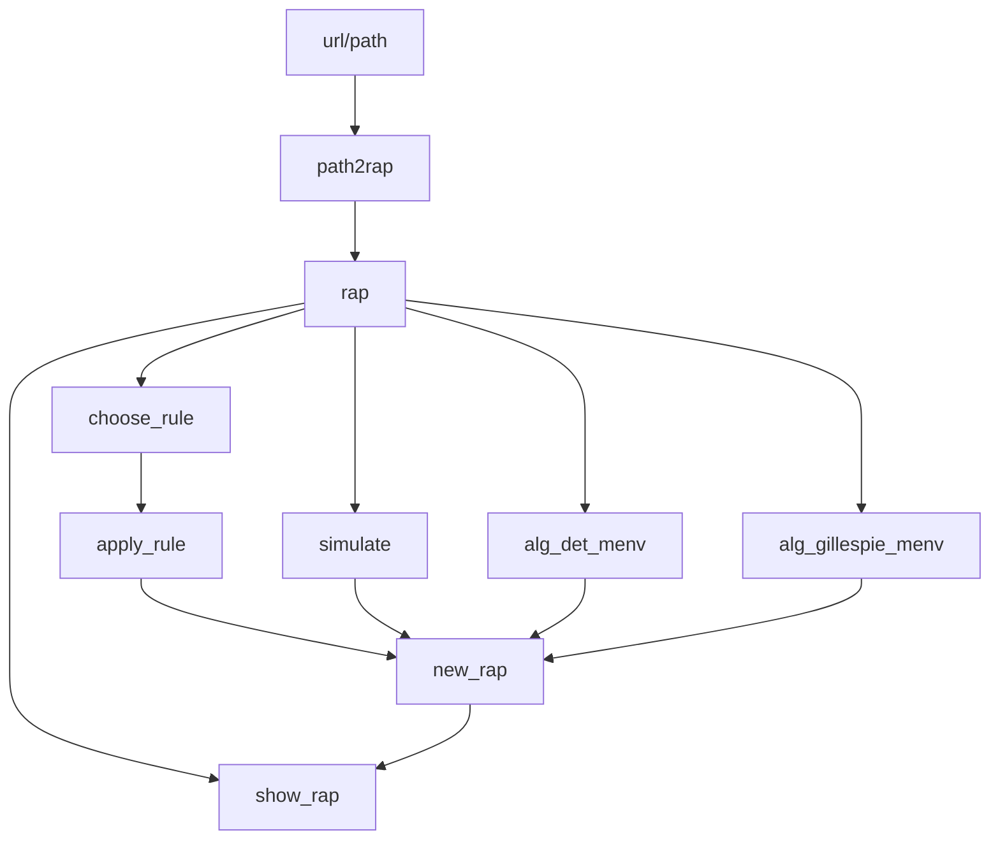

# 🎤 RAPS: R Aid for P systems
Welcome to the repository behind the `RAPS` package.


## Quickstart
<!-- Help for mermaid: http://mermaid-js.github.io/mermaid/#/ -->

Run the following to install the package locally, directly from GitHub:
```{r}
devtools::install_github("Xopre/RAPS")
```

Now you can run every example in the [`demos`' folder](demos/). Give the [deterministic waiting time](demos/deterministic_waiting_time_algorithm.Rmd) a try!

Main workflow with `RAPS`:


In `RAPS` we use the `rap` (Representing A P system) objects, which have the following aspect:

$Configuration

| Environment | ID | Label | Objects         | SuperM   | SubM  | Charge | Other_params |
|-------------|----|-------|-----------------|----------|-------|--------|--------------|
| 1           | 1  | 1     | [(a, 1)]        | 0        | [2,3] |     -1 | @immutable   |
| 1           | 2  | 2     | [(b, 2), (c,3)] | 1        | NULL  |     +1 | NA           |
| 1           | 3  | 3     | [(@filler, 1)]  | 1        | NULL  |     +1 | NA           |

$Rules
| rule_id | dissolves | priority | main_membrane_label | lhs | rhs | propensity
|---------|-----------|----------|--------------------|-----|-----|----------------|
| value0 | FALSE | - | 1 | $lhs_1$ | $rhs_1$ | 1974 |

$Properties
| System | PLingua_model | N_membranes | N_environments | N_objects | N_rules |
|--------|---------------|--------------|---------------|-----------|--------|
| FAS | Stochastic | 4 | 1 | 53 | 99 |

where:

$$lhs_1 = \begin{pmatrix} 
  where & object & multiplicity \\
  \hline \\
  @here & a & 1 \\
  mem_2 & b & 2 \\
  @exists & mem_3 & 1 \\
  \end{pmatrix}$$
s
$$rhs_1 = \begin{pmatrix} 
  where & object & multiplicity \\
  \hline \\
  @here & ap & 2 \\
  mem_2 & bp & 3 \\
  \end{pmatrix}$$

## **Main functions**

- `path2rap()`: Create a `rap` object from a path.
- `alg_det_menv()`: Run the deterministic algorithm on a `rap` object.
- `alg_gillespie_menv()`: Run the Gillespie algorithm on a `rap` object.
- `simulate()`: Run a custom simulation algorithm on a `rap` object.
- `show_rap()`: Show a `rap` object.
- `apply_rule()`: Apply a rule to a `rap` object.
- `choose_rule()`: Choose a rule to apply.

## **Supported rules**

Supported rules:
* Evolution: $[u \rightarrow v]_i$
* In-communication: $[\ u \rightarrow v_1 \ [v_2]_j\ ]_i$
* Out-communication: $[\ u_1 \ [u_2]_j \rightarrow v\ ]_i$
* In/Out-communication: $[\ u_1 \ [u_2]_j \rightarrow v_1 \ [v_2]_k\ ]_i$

Will-be-supported rules, by priority:
1. Charge change: $[u]_i^{\alpha}  \rightarrow [v]_i^{\beta}$
2. Dissolution: $[u \rightarrow v, \lambda]_i$
3. Membrane generation: $u \rightarrow [\ ]_i$
3. Membrane division: $[a]_i \rightarrow [b]_j [c]_k$

Might be supported but are nonstandard:
* Presence of one or more membranes: $[\ ]_i [\ ]_j \rightarrow a$
* Presence of the *residual* of an object: $a^0 \rightarrow b$
* Crazy multicommunication: $[u_1]_i [u_2]_j [u_3]_k \rightarrow [v_1]_{ip} [v_2]_{jp} [v_3]_{kp}$


# Other stuff
- [Check this presentation](https://docs.google.com/presentation/d/1j6y3RAkCeWzvKYxJpqVUsSfh9C7p0uOEtQdWj0bbCUw/edit#slide=id.p)

### **General objectives:**
- [x] Create `README.md`
- [x] Complete `README.md`
  - [x] Workflow diagram
  - [x] Functional demos
  - [x] Simulation of stochastic P systems
    - [x] Monoenvironmental Gillespie algorithm
    - [x] Multienvironmental Gillespie algorithm
      - [ ] Revised.
    - [x] Multienvironmental deterministic waiting time algorithm
- [x] Establish the deprecated functions as such

- [x] Prepare RAPS object for monoenvironmental P systems
- [x] Prepare RAPS object for multienvironmental P systems

- [x] Adapt parser to P-Lingua 5 in function `path2rap()`
- [x] Create one or more simulators for RAPS' objects

## Contents
<!-- ! CHECKME -->
* `.Rproj.user/`: User data.
* `demos/`: Examples of use of the RAPS package.
* `man/`: `roxygen2`-generated documentation.
* `R/`: The functions included in this package.
* `RData/`: `RData` for some demos.
* `renv/`: Folder for the `renv` package.
* `semantics/`: Folder for different semantics.
* `utils/`: Some auxiliar code. Do not pay much attention.
  * `UPDATE.R`: Utility for updating the package.
  * `RAPS_package.Rmd`: The father of `UPDATE.R`.
* `.gitignore`: git-ignored files.
* `.Rbuildignore`: Build ignored files.
* `.Rhistory`: Ignore this. Should be empty.
* `.Rprofile`: My profile.
* `DESCRIPTION`: Description of the package.
* `NAMESPACE`: `roxygen2`-generated documentation about exports.
* `RAPS.Rproj`: The project wherein everything is developed.
* `README.md`: The document you're reading right now.
* `renv.lock`: Info for the `renv` package.


#### TODO
- [ ] Achieve control over time