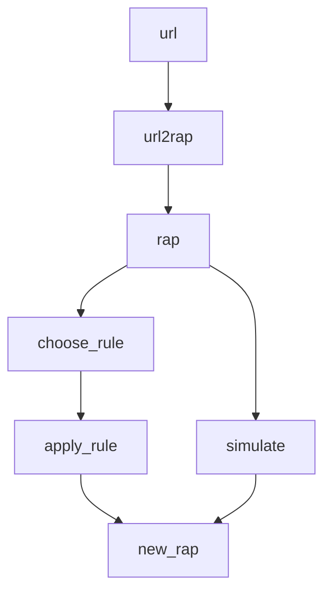

# RAPS: R Aid for P systems
Welcome to the repository behind the RAPS package.

## Quickstart
<!-- Help for mermaid: http://mermaid-js.github.io/mermaid/#/ -->
Main workflow with `RAPS`:


## Status
**General objectives:**
- [x] Create `README.md`
- [ ] Complete `README.md`
  - [x] Workflow diagram
  - [ ] Functional demos
  - [ ] Simulation of stochastic P systems

- [ ] Adapt parser to P-Lingua 5
- [ ] Create one or more simulators:
  - [ ] A general simulator
  - [ ] For P-Lingua 5

**Functions**
- [x] Organise the main functions in the "Functions" section
- [ ] Establish the deprecated functions as such

`R/read_xml_p_system.R`
- [ ] Check using of `unnest_wider`, `longer` or `auto` to reduce the use of lists
- [ ] Improve `rhs_multisets` with `process_multiset` and `print_multiset`, just as I did before with `lhs_multisets`

`R/simulate_p_system.R`
- [ ]  Make it work
  - [ ] Begin with basic evolution rules.
  
## Functions

### New ideas
> **Important**: The name of the main class considered is `rap`, for *Representing A P-system*, and also to attune with the name of the package.

* `apply_rule`
* `choose_rule`
* `tib2rap`
* `df2rap`
* `url2rap(format = "pl5")`
* `show_rap`

Ideal order of application (as shown by the abovementioned `mermaid` diagram):
```{r}
my_rap = data.frame %>%
  tib2rap()
  
my_rap = my_url %>%
  url2rap(format = "pl5")
  
selected_rule = my_rap %>%
  choose_rule()
  
new_rap = my_rap %>%
  apply_rule(selected_rule)
```

### Original
* `na_omit`
* `print_multiset`
* `process_multiset`
* `read_ps5`
* `read_xml_p_system`
* `simulate_p_system`

## Contents
* `.Rproj.user/`: User data.
* `demos/`: Examples of use of the RAPS package.
* `man/`: `roxygen2`-generated documentation.
* `R/`: The functions included in this package.
* `RData/`: `RData` for some demos.
* `renv/`: Folder for the `renv` package.
* `semantics/`: Folder for different semantics.
* `utils/`: Some auxiliar code. Do not pay much attention.
  * `UPDATE.R`: Utility for updating the package.
  * `RAPS_package.Rmd`: The father of `UPDATE.R`.
* `.gitignore`: git-ignored files.
* `.Rbuildignore`: Build ignored files.
* `.Rhistory`: Ignore this. Should be empty.
* `.Rprofile`: My profile.
* `DESCRIPTION`: Description of the package.
* `NAMESPACE`: `roxygen2`-generated documentation about exports.
* `RAPS.Rproj`: The project wherein everything is developed.
* `README.md`: The document you're reading right now.
* `renv.lock`: Info for the `renv` package.
