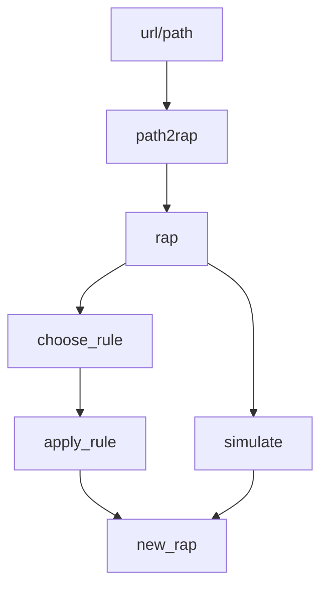

# 🎤 RAPS: R Aid for P systems
Welcome to the repository behind the RAPS package.


## Quickstart
<!-- Help for mermaid: http://mermaid-js.github.io/mermaid/#/ -->

Run the following to install the package locally, directly from GitHub:
```{r}
devtools::install_github("Xopre/RAPS")
```

Main workflow with `RAPS`:

<!-- 
# rap- ->simulate_gil;
# simulate_gil- ->new_rap;
# 
# rap- ->simulate("GIL");
# simulate("GIL)- ->new_rap;
-->

In `RAPS` we use the `rap` (Representing A P system) objects, which have the following aspect:

Environment | ID | Label | Objects         | SuperM   | SubM | Charge | Other_params | 
------------|----|-------|-----------------|----------|------|--------|--------------|
1           | 1  | 1     | [(a, 1)]        | 0 (skin) | 2    |     -1 | NULL         |
1           | 2  | 2     | [(b, 2), (c,3)] | 1        | NULL |     +1 | NULL         |

## Status

### **General objectives:**
- [x] Create `README.md`
- [ ] Complete `README.md`
  - [x] Workflow diagram
  - [x] Functional demos
  - [ ] Simulation of stochastic P systems
    - [x] Monoenvironmental Gillespie algorithm
    - [ ] Multienvironmental Gillespie algorithm

- [x] Prepare RAPS object for monoenvironmental P systems
- [ ] Prepare RAPS object for multienvironmental P systems

- [ ] Adapt parser to P-Lingua 5
- [ ] Create one or more simulators:
  - [ ] A general simulator
  - [ ] For P-Lingua 5
  - [ ] For RAPS' objects

### **Functions**
- [x] Organise the main functions in the "Functions" section
- [ ] Establish the deprecated functions as such
- [ ] Achieve control over time

### **Rules**

Supported rules:
* Evolution: $[u \rightarrow v]_i$
* In-communication: $[\ u \rightarrow v_1 \ [v_2]_j\ ]_i$
* Out-communication: $[\ u_1 \ [u_2]_j \rightarrow v\ ]_i$
* In/Out-communication: $[\ u_1 \ [u_2]_j \rightarrow v_1 \ [v_2]_k\ ]_i$

Will-be-supported rules, by priority:
1. Charge change: $[u]_i^{\alpha}  \rightarrow [v]_i^{\beta}$
2. Dissolution: $[u \rightarrow v, \lambda]_i$
3. Membrane generation: $u \rightarrow [\ ]_i$
3. Membrane division: $[a]_i \rightarrow [b]_j [c]_k$

Might be supported but are nonstandard:
* Presence of one or more membranes: $[\ ]_i [\ ]_j \rightarrow a$
* Presence of the *residual* of an object: $a^0 \rightarrow b$
* Crazy multicommunication: $[u_1]_i [u_2]_j [u_3]_k \rightarrow [v_1]_{ip} [v_2]_{jp} [v_3]_{kp}$

# TODO: Check the following sections

## Functions

`R/read_xml_p_system.R`
- [ ] Check using of `unnest_wider`, `longer` or `auto` to reduce the use of lists
- [ ] Improve `rhs_multisets` with `process_multiset` and `print_multiset`, just as I did before with `lhs_multisets`

`R/simulate_p_system.R`
- [ ]  Make it work
  - [ ] Begin with basic evolution rules.
  
### New ideas
> **Important**: The name of the main class considered is `rap`, for *Representing A P-system*, and also to attune with the name of the package.

* `apply_rule`
* `choose_rule`
* `tib2rap`
* `df2rap`
* `url2rap(format = "pl5")`
* `show_rap`

Ideal order of application (as shown by the abovementioned `mermaid` diagram):
```{r}
my_rap = data.frame %>%
  tib2rap()
  
my_rap = my_url %>%
  url2rap(format = "pl5")
  
selected_rule = my_rap %>%
  choose_rule()
  
new_rap = my_rap %>%
  apply_rule(selected_rule)
```

### Original
* `na_omit`
* `print_multiset`
* `process_multiset`
* `read_ps5`
* `read_xml_p_system`
* `simulate_p_system`

## Contents
* `.Rproj.user/`: User data.
* `demos/`: Examples of use of the RAPS package.
* `man/`: `roxygen2`-generated documentation.
* `R/`: The functions included in this package.
* `RData/`: `RData` for some demos.
* `renv/`: Folder for the `renv` package.
* `semantics/`: Folder for different semantics.
* `utils/`: Some auxiliar code. Do not pay much attention.
  * `UPDATE.R`: Utility for updating the package.
  * `RAPS_package.Rmd`: The father of `UPDATE.R`.
* `.gitignore`: git-ignored files.
* `.Rbuildignore`: Build ignored files.
* `.Rhistory`: Ignore this. Should be empty.
* `.Rprofile`: My profile.
* `DESCRIPTION`: Description of the package.
* `NAMESPACE`: `roxygen2`-generated documentation about exports.
* `RAPS.Rproj`: The project wherein everything is developed.
* `README.md`: The document you're reading right now.
* `renv.lock`: Info for the `renv` package.
